# Memory that audits itself: a Qwen MemoryAgent you can actually trust

*Global AI Hackathon Series with Qwen Cloud — MemoryAgent track.*

Most "agent memory" demos prove one thing: the agent can write a fact in one
session and read it back in another. That's necessary, but it's the easy half.
The hard half — the half nobody shows — is what happens when the agent's own
memory starts to **disagree with itself**.

A cross-session agent accumulates facts from many separate write events, over
days, across processes. Nothing stops two of those writes from recording the same
record two different ways: one session records a payroll event's employer cost at
€18,000, a later session records €19,000 for the same event. A plain vector store does the worst
possible thing here — it silently returns whichever one happened to rank higher,
and never tells you the two ever conflicted. Your agent is now confidently wrong,
and you have no way to know.

**Archon MemoryAgent** is our entry for the MemoryAgent track, built on Qwen
(`text-embedding-v4` + `qwen-plus`) with a pgvector memory layer, running live on
Alibaba Cloud. It does the cross-session part properly — but its headline is the
part that's usually missing: **the memory audits itself.**

## System Architecture

Below is the system architecture diagram showing the ingestion pipeline, MemoryAgent core, and Qwen Cloud / Alibaba Cloud integration:



The trust boundary matters as much as the model graph. The public surface is a fixed,
idempotent demo plus public-tenant reads; public seed and recall are quota-bounded.
Writes, feedback, lifecycle operations, meaning-level audit, and Streamable HTTP MCP
are authenticated and mapped to a tenant by the server. The event linker groups by
`company + period + event_ref`, and P&L totals stay separated by currency. The editable
source and PNG/SVG renders live in [`docs/`](../docs/architecture.mmd).

## The innovation: detect → resolve

The agent exposes `POST /consistency`, a pure, domain-neutral audit over its own
active memories. It groups memories by the record they describe (an explicit
record id, or the originating `sourceRef` — never a coarse company/period key that
would manufacture false conflicts) and flags two memory-native problems:

- **Contradiction** — two write events assign **different values** to the **same
  attribute** of the **same record**. Because each memory carries its own write
  timestamp, a contradiction is literally two sessions that remembered the record
  differently.
- **Absence** — a memory references another record that **no memory stores**: a
  dangling reference, an expected counterpart the agent never actually captured.

But detection alone isn't enough — if the memory tells you two values disagree,
your next question is *which one do I trust?* So for every contradiction the audit
also emits a **resolution recommendation**: `{ recommendedMemoryId,
recommendedValue, rule, confidence, rationale }`, decided by a fixed priority
ladder over signals **already on the memories** — no new data, no domain rulebook:

1. **importance** — an explicitly flagged, high-salience memory outranks a later
   write with none.
2. **source-authority** — a structured record outranks a derived narrative note
   for a raw value.
3. **recency** (default) — otherwise the later write wins; the newest session
   presumably corrected the older one.

Crucially, it is a **recommender, not ground truth**. The audit can't know which
write was actually correct — only which one a defensible policy prefers. It
**never mutates memory**; it surfaces the disagreement, recommends a side with a
confidence and a one-line rationale, and lets the caller decide. That's the whole
point: memory you can trust *because it tells you when it disagrees with itself*,
instead of hiding it.

### Contradictions in *meaning*, too

The audit above compares metadata fields, so it is blind to memories that oppose
each other in **meaning** while sharing no comparable key — *"vendor always pays
on time"* vs *"vendor is chronically late"*. Neither carries a numeric attribute to
compare, so the field-level audit groups nothing and reports OK; the disagreement
lives entirely in the prose. A companion **semantic** audit (`POST
/consistency/semantic`, `src/memory/semantic-consistency.ts`) closes that gap. It
embeds each memory with the same `text-embedding-v4` recall path, keeps only
same-subject pairs by cosine, then asks a judge whether they directly contradict —
**qwen-plus** online (real semantic reasoning), a deterministic polarity/negation
heuristic offline so it still runs in CI with no key. The online judge **fails
closed**: any error or unparseable reply is treated as "no contradiction", never a
manufactured one. It reuses the **same read-only resolution ladder** and, like the
rule-based path, **never mutates memory** — it runs *alongside* the field-level
engine, additive, neither replacing the other. It is exposed over authenticated,
quota-bounded HTTP and HTTP MCP (the `audit_memory` tool takes `semantic: true`),
and its fixed contradiction pair is planted by the public idempotent demo seed
so you can see the agent catch a meaning-level contradiction in its own memory.
(Honest scope: the semantic detector is a *proven mechanism with a working live
demo, full offline unit coverage, and a scored labelled set for the deterministic
offline judge (not a live-Qwen accuracy claim) — see
`BENCHMARK.md`.)

## It's measured, offline, and reproducible

Claims about memory quality are cheap. We made ours reproducible from committed
fixtures — no API key, no spend, gated in CI:

**Retrieval.** On real `text-embedding-v4` embeddings, over a frozen, diverse,
hand-labelled corpus, our `reranked-hybrid` retriever (dense + lexical fused with
Reciprocal Rank Fusion, then a `qwen-plus` cross-encoder re-rank) beats a strong
single-vector dense baseline on **every** metric:

| Metric | dense baseline | reranked-hybrid |
|---|---:|---:|
| MRR | 0.883 | **0.911** |
| nDCG@5 | 0.903 | **0.938** |
| Recall@3 | 90.0% | **96.7%** |

The dense baseline is not a strawman — a single-vector cosine ANN search is the
default retrieval mode of LangChain's `VectorStoreRetriever` and of virtually
every pgvector RAG demo, so beating it is beating what the field ships by default.
(We were honest where honesty cost us: hybrid *alone* does **not** beat a modern
embedder on top-rank ordering on a clean corpus — that's why we added the
cross-encoder, and reported the null result rather than tuning the corpus back
toward duplicates.) A meaning-shuffled control retriever collapses to near chance,
proving the benchmark actually discriminates semantics.

**Self-audit.** On a labelled dataset of injected conflicts plus a consistent
control set (agreeing re-ingests, float-noise, distinct records sharing an
attribute name):

> **5 / 5 injected problems detected, 0 false positives** — 100% detection, 100%
> precision. The precision number is load-bearing: the control set exists to prove
> the audit stays *silent* on things that only look like conflicts.

**Resolution.** On contradictions hand-labelled with the memory that should win
and the rule that should decide it:

> **4 / 4 winners recommended correctly, 4 / 4 rules correct**, with structural
> invariants (every contradiction resolved, recommendation points at a real
> memory, confidence in [0,1]) enforced too.

We're explicit about the caveat: this measures **policy-conformance, not
policy-optimality** — a 100% means the recommender faithfully implements its
stated, defensible policy, not that the policy is universally right. Which is
exactly why it's a recommendation with a confidence, never an auto-edit.

## Cross-session persistence — done properly

The track's core requirement still has to hold, and it does. Our headline
end-to-end test writes memories in Session A, tears the process down completely
(pool closed — nothing survives in-process), then a **brand-new Session B** with
fresh instances and no shared state recalls those memories by meaning and narrates
a grounded, cited `qwen-plus` answer. The only thing shared between the two
sessions is the database. That's what "persistent, cross-session memory" means,
and it's a gated test, not a slide.

## What it's a memory *of*

The shipped financial proof has two explicit inputs: a document pipeline that fuses
a payroll register, bank confirmation, and payslips; and a strict JSON path for
purchase/sales invoices. Over those memories it reports payroll cost, purchases,
sales, known/unknown cash, and net profit **per currency**. If currencies are mixed,
top-level monetary totals are `null` and `by_currency` carries independent totals.
Payroll without a stated currency is `UNSPECIFIED`, never silently EUR.

That scope is intentionally narrower than the broader Archon roadmap. This entry
does not claim shipped order/receipt/general-bank-statement extraction, EBITDA, or
sales targets.

## The stack, and where it runs

- **Qwen models:** `text-embedding-v4` (1024-dim embeddings), `qwen-plus` (RAG
  narration, rerank, semantic judge, and skills), and `qwen-vl-max` (payroll-document
  vision extraction), via Alibaba Cloud Model Studio / DashScope.
- **Memory store:** pgvector on PostgreSQL — `agent_memory(embedding vector(1024))`
  with an HNSW cosine index, semantic recall as `ORDER BY embedding <=> $query`.
- **Live deployment:** an Alibaba Cloud **ECS** instance (`ecs.e-c1m2.large`,
  ap-southeast-1) running docker-compose — the backend container alongside a
  self-hosted **pgvector container** as the memory store, behind one public URL.
  Because the store is pg-wire, the identical code runs unchanged against a managed
  ApsaraDB RDS / AnalyticDB for PostgreSQL instance (the Function Compute
  alternative shipped in `deploy/`), a drop-in `DATABASE_URL` swap.

Offline, with no DashScope key, deterministic Fakes exercise the model seams and the
pgvector/fixture path with zero cloud credentials. Production is fail-closed: real
Qwen plus configured judge authentication are required for `/ready`.

## Try it

```bash
cp .env.example .env
# Fill POSTGRES_PASSWORD + both DATABASE_URL values with the same URL-safe
# random password; set a separate 32+ character JUDGE_API_KEY.
set -a; . ./.env; set +a
npm ci
docker compose -f docker-compose.yml -f docker-compose.dev.yml up -d db
npm run db:schema
npm run memory:demo                 # write the payroll evidence, recall by meaning
npm run bench -- --gate             # retrieval: regression + fusion + discrimination gates
npm run bench:consistency -- --gate # self-audit: 5/5 detected, 0 false positives
npm run bench:semantic -- --gate    # meaning audit: 90% recall, 100% precision, 0 FP
npm run bench:resolution -- --gate  # resolution: 4/4 winners correct
```

The easy half of agent memory is remembering. The half that makes it trustworthy
is knowing when you've remembered something two different ways — and saying so.
That's what we built.

---

*Repo: `README.md` (architecture + quickstart) · `BENCHMARK.md` (full method and
honest caveats) · MIT licensed.*
