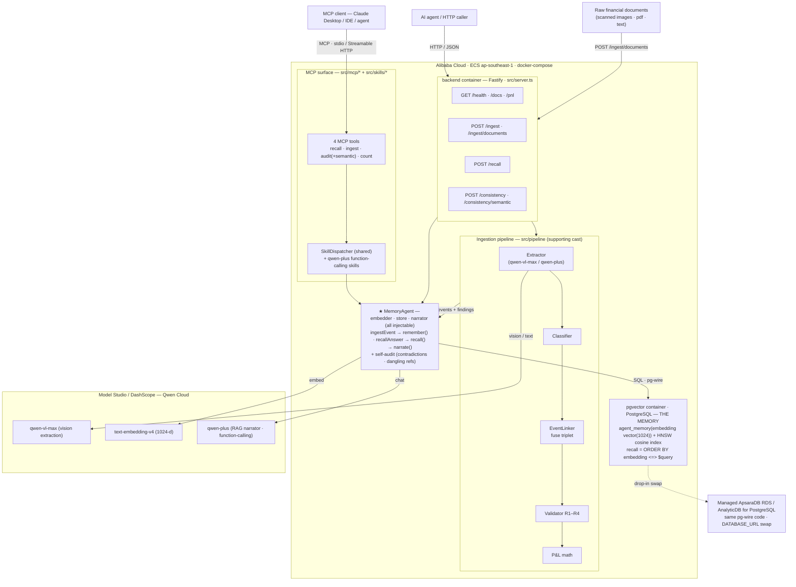

# Archon MemoryAgent — self-auditing memory for AI agents

*Project story for the Global AI Hackathon Series with Qwen Cloud — MemoryAgent track. Method, numbers, and honest caveats live in [BENCHMARK.md](../BENCHMARK.md).*

## Inspiration

Two frustrations collided, and the project lives in the gap between them.

The first: **AI agents are brilliant and amnesiac.** Give an agent a hard problem and it reasons beautifully — then the session ends and it forgets everything. The next run starts cold, re-deriving what it already knew an hour ago. A *MemoryAgent* is supposed to fix that: persistent, queryable memory that survives across sessions.

The second is the one almost nobody talks about: **once an agent remembers a lot of things, some of them will disagree.** Memory accumulates from many separate write events, from different sources, at different times. Sooner or later two of those memories describe the *same fact* with *different values*. A naive memory just stores both, returns whichever ranked higher, and stays silent about the conflict.

Financial intelligence made this concrete. A business's financial truth is scattered across invoices, orders, receipts, bank transfers, and workforce-cost records. The same event is often recorded more than once — and the numbers don't always match. We didn't want a memory that confidently hands back a number while hiding that it disagreed with itself. We wanted a memory that is **honest about what it holds**.

So the guiding question became: *not just how does an agent remember, but how does an agent stay truthful as its memory grows?*

## What it does

**Archon MemoryAgent** gives a unified financial-intelligence pipeline a persistent memory.

Every fused financial event, validation finding, and narrated insight is embedded with **Qwen `text-embedding-v4`** and written to a **pgvector** store. On any later run — a different session, process, or container — the agent **recalls the relevant prior facts by meaning** and grounds a **Qwen `qwen-plus`** answer in them, citing the exact memories it used.

It exposes a small HTTP surface: `/ingest` (write memories for an event), `/recall` (grounded, cited answer), `/consistency` (the field-level self-audit) and `/consistency/semantic` (the meaning-level self-audit), plus `/consolidate` and `/forget` for hygiene — and an interactive `/docs` explorer.

Three ideas make the memory *strong*, not merely present:

1. **Recall that respects exact tokens** — hybrid dense + lexical retrieval, refined by a cross-encoder re-ranker.
2. **Memory that audits itself** — a pure function that flags when two of the agent's own memories contradict, and *recommends* which to trust without ever mutating them.
3. **Honest measurement** — every claim above is backed by a frozen, reproducible benchmark, including a real head-to-head against Mem0.

## System Architecture

Below is the system architecture diagram showing the ingestion pipeline, MemoryAgent core, and Qwen Cloud / Alibaba Cloud integration:

## How we built it

The service is **TypeScript on Fastify**, deployed live on **Alibaba Cloud ECS** (with a serverless Function Compute + managed RDS path as an alternative). Qwen models are called through the OpenAI-compatible DashScope endpoint. The memory lives in `pgvector` on PostgreSQL.

### Recall — meaning *and* exact tokens

A single-vector cosine search is the default of virtually every RAG demo, and it has a blind spot: dense embeddings blur the exact tokens agent memories are full of — document numbers like `INV-2043`, currency figures, company names, period codes.

Recall starts from cosine similarity over the embedding space:

$$
\operatorname{sim}(\mathbf{q}, \mathbf{d}) = \frac{\mathbf{q} \cdot \mathbf{d}}{\lVert \mathbf{q} \rVert \, \lVert \mathbf{d} \rVert}
$$

To recover the exact-token signal, we fuse that dense ranking with a lexical (BM25 / full-text) ranking using **Reciprocal Rank Fusion**:

$$
\operatorname{RRF}(d) = \sum_{r \in \{\text{dense},\, \text{lexical}\}} \frac{1}{k + \operatorname{rank}_r(d)}
$$

Fusion makes recall *robust* (it never does worse than dense), but robustness alone doesn't win the top rank. So a **cross-encoder re-ranker** (`qwen-plus` scoring each query/memory pair jointly) refines the head of the list — and that is what lifts the ordered-retrieval metrics:

$$
\operatorname{nDCG}@k = \frac{\operatorname{DCG}@k}{\operatorname{IDCG}@k}, \qquad \operatorname{DCG}@k = \sum_{i=1}^{k} \frac{2^{\text{rel}_i} - 1}{\log_2(i + 1)}
$$

### Self-audit — detect, then recommend, never mutate

The headline capability. `POST /consistency` scans the agent's own memories, groups them by the record they describe, and flags two failure modes:

- **Cross-session contradictions** — same record and attribute, different value across write events.
- **Dangling references** — a memory points at a record that no memory stores.

Detecting a conflict is the easy half. The hard half is *what to do about it*. Rewriting memory at conflict time — the approach taken by systems that silently ADD/UPDATE/DELETE — throws away information and hides the disagreement. So instead of mutating, the audit returns a **recommendation** under a fixed, domain-neutral priority ladder evaluated lexicographically:

$$
\text{winner} = \operatorname*{arg\,max}_{m \in \text{conflict}} \; \big\langle\, \text{importance}(m),\; \text{authority}(m),\; \text{recency}(m) \,\big\rangle
$$

Higher importance wins; ties break on source authority; remaining ties break on recency (the later write wins). The result carries `rule + confidence + rationale`, so a human or agent can accept or override it. It is a **recommender, not ground truth** — the memory is never overwritten.

### The audit sees *meaning*, not just fields

`POST /consistency` compares metadata fields, so it is blind to a whole class of real contradiction: two memories that oppose each other in *meaning* while sharing no comparable key — *"vendor always pays on time"* vs *"vendor is chronically late"*. A companion **semantic** audit (`POST /consistency/semantic`, `src/memory/semantic-consistency.ts`) closes that gap, additively. It embeds each memory with the same `text-embedding-v4` recall path, keeps only same-subject pairs by cosine, then asks a judge whether they *directly* contradict — **qwen-plus** online, a deterministic polarity/negation heuristic offline (so it still runs in CI with no key). The online judge **fails closed**: an upstream error is "no contradiction", never a fabricated one. It reuses the **same read-only resolution ladder**, never mutates memory, and is reachable over HTTP, over MCP (`audit_memory` with `semantic: true`), and in the seeded live demo. Honest scope: a proven mechanism with a working live demo and full offline unit coverage — not yet a scored labelled-set benchmark (that's the stated next step in `BENCHMARK.md`).

### Offline-first engineering

Every external dependency has an injectable seam. With no `DASHSCOPE_API_KEY`, a deterministic `FakeEmbedder` and `FakeNarrator` engage, so the full pgvector write-and-recall path still runs — with **zero credentials and zero spend**. That single decision is what lets the entire test pyramid and every benchmark run in CI, offline, on every commit.

## Challenges we ran into

- **Exact-token recall.** Getting document numbers and currency figures to survive retrieval took the full hybrid + RRF + re-rank stack, each stage earning its place against the benchmark.
- **Domain-neutral contradiction detection.** The self-audit had to be a *pure, general* engine — no finance rulebook baked in — so it groups and compares on structure alone. Keeping it domain-neutral while still catching real conflicts was the core design tension.
- **Resolving without mutating.** The tempting shortcut is to overwrite the "loser" at conflict time. Designing a resolution that *recommends* — with a rule, a confidence, and a rationale — while leaving the memory intact took several iterations of the priority ladder.
- **Measuring honestly.** Reproducibility meant freezing labelled fixtures and committing real embeddings, then adding a *sensitivity control* — a meaning-shuffled retriever that must score near chance — to prove the benchmark actually discriminates rather than rewarding noise.
- **A fair head-to-head.** To compare against Mem0 credibly we installed it (`mem0ai`), drove it with the *same* Qwen models and the *same* conflict pairs, and reported the honest result: retrieval at parity, but no contradiction/resolution API.
- **Deploying on Alibaba under a deadline.** We chose an ECS + `pgvector`-container topology for a single always-reachable URL, and — because the store speaks the Postgres wire protocol — kept a managed-RDS path as a drop-in `DATABASE_URL` swap rather than a rewrite.

## Accomplishments that we're proud of

- **A memory that audits itself — and it's measured.** Cross-session contradiction detection at **5/5 with 0 false positives** on a labelled control set (100% precision), and a resolution recommender that is **4/4 correct** on a labelled set — while *never* mutating memory.
- **A retrieval win over the field default, not a strawman.** The `reranked-hybrid` retriever beats the single-vector cosine baseline that LangChain and most pgvector demos ship: **MRR 0.883 → 0.911**, **nDCG@5 0.903 → 0.938**, **Recall@3 90.0% → 96.7%**.
- **An honest accuracy number on our own answers.** Gold-memory **recall@5 100%**, answer **correctness 100%**, and answer **grounding 90.9%** — we report the 90.9%, not a suspicious 100%, because one answer cites a *derived* figure the metric correctly refuses to credit.
- **A real, reproducible comparison to Mem0.** Installed and driven with the same models on the same conflict pairs; result stated plainly (retrieval parity; no conflict/resolution API in Mem0), with Zep cited honestly.
- **Reproducible with zero credentials.** The full pipeline, test pyramid, and every benchmark gate run offline in CI via deterministic Fakes — no key, no spend.
- **A complete engineering package.** Unit + integration + e2e + benchmark gates + a k6 load tier, an interactive OpenAPI `/docs` explorer, CodeQL and secret scanning, all green — plus a live public URL on Alibaba Cloud.

## What we learned

- **Dense retrieval alone is a trap for agent memory.** The moment memories carry identifiers and figures, you need a lexical channel and a re-ranker. Hybrid + re-rank wasn't gold-plating; it was the difference between recalling the right fact and a plausible neighbour.
- **Detecting a contradiction is easy; deciding what to do is the real design problem.** The valuable move was refusing to mutate — surfacing the disagreement and *recommending*, rather than quietly picking a winner and erasing the evidence.
- **"Better than baseline" only means something if the baseline is what people actually ship.** We benchmarked against the single-vector cosine retriever that is the field default, not a strawman — so the win reflects real practice.
- **Honesty is a feature.** Reporting the 90.9% grounding miss, the retrieval *parity* (not a win) against Mem0, and Zep's genuine strengths makes every other number we report believable.

## What's next for Archon MemoryAgent : self-auditing memory for AI agents

- **A fully-managed Alibaba store.** The `MemoryStore` interface is the seam a managed **DashVector** (or Tair) store would slot into, with no change to the agent.
- **Richer resolution signals.** Extend the priority ladder with provenance and corroboration (how many independent memories agree), and calibrate the confidence score against outcomes.
- **Larger, longer-lived evaluation.** Bigger labelled sets and consolidation/forgetting policies tuned on memories that live for weeks, not one demo.
- **Agent-in-the-loop resolution.** Let a calling agent accept, override, or defer each recommendation, and feed those decisions back as a new authority signal.
