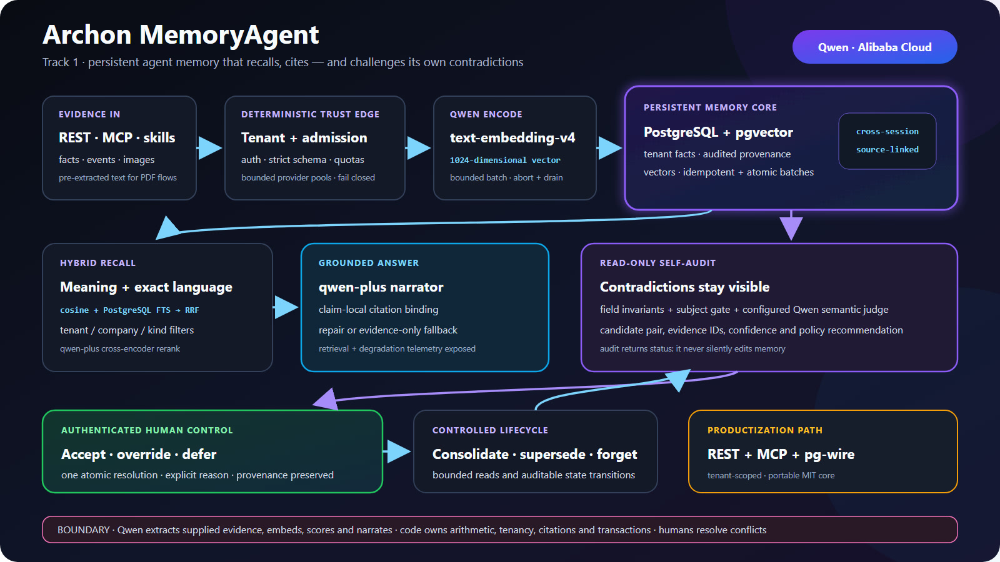

# Archon MemoryAgent — self-auditing memory for AI agents

*Project story for the Global AI Hackathon Series with Qwen Cloud — MemoryAgent track. Method, numbers, and honest caveats live in [BENCHMARK.md](../BENCHMARK.md).*

## Inspiration

Two frustrations collided, and the project lives in the gap between them.

The first: **AI agents are brilliant and amnesiac.** Give an agent a hard problem and it reasons beautifully — then the session ends and it forgets everything. The next run starts cold, re-deriving what it already knew an hour ago. A *MemoryAgent* is supposed to fix that: persistent, queryable memory that survives across sessions.

The second is the one almost nobody talks about: **once an agent remembers a lot of things, some of them will disagree.** Memory accumulates from many separate write events, from different sources, at different times. Sooner or later two of those memories describe the *same fact* with *different values*. A naive memory just stores both, returns whichever ranked higher, and stays silent about the conflict.

Financial intelligence made this concrete. The shipped demo fuses a payroll register, bank confirmation, and payslips, and also accepts strict purchase/sales invoice records. The same event can be written more than once — and the values do not always match. We did not want a memory that confidently hands back a number while hiding that it disagreed with itself. We wanted a memory that is **honest about what it holds**.

So the guiding question became: *not just how does an agent remember, but how does an agent stay truthful as its memory grows?*

## What it does

**Archon MemoryAgent** gives a unified financial-intelligence pipeline a persistent memory.

Every fused financial event, validation finding, and narrated insight is embedded with **Qwen `text-embedding-v4`** and written to a **pgvector** store. On any later run — a different session, process, or container — the agent **recalls the relevant prior facts by meaning** and grounds a **Qwen `qwen-plus`** answer in them, citing the exact memories it used.

It exposes a small HTTP surface: public-tenant `/recall`, `/pnl`, and `/consistency`; authenticated tenant-scoped `/ingest`, `/ingest/invoice`, `/ingest/documents`, `/feedback`, `/consistency/semantic`, `/consolidate`, and `/forget`; plus `/docs` and `/ready`. Qwen-spending routes have per-subject/IP plus global daily quotas. Document ingestion has a protected `dryRun` that executes extraction, linking, validation, and P&L, reports the extractor models, and writes no memory. Lifecycle calls preview by default and require `confirm=true` to change state.

Four ideas make the memory *strong*, not merely present:

1. **Recall that respects exact tokens** — hybrid dense + lexical retrieval, refined by one bounded listwise `qwen-plus` re-rank call.
2. **Memory that audits itself** — a pure function that flags when two of the agent's own memories contradict, and *recommends* which to trust without ever mutating them.
3. **Feedback and bounded lifecycle** — explicit corrections supersede bad memories and remain recallable in a fresh session; this is persisted state, not model-weight learning. Consolidation/forgetting are tenant-scoped and safe-by-default.
4. **Honest measurement** — every quality claim above is backed by a frozen, reproducible benchmark, including a pinned head-to-head against Mem0.

## System Architecture

Below is the system architecture diagram showing the ingestion pipeline, MemoryAgent core, and Qwen Cloud / Alibaba Cloud integration:

The canonical judge-facing asset is the 16:9 [`demo/final-media/judge-architecture.jpg`](./final-media/judge-architecture.jpg), generated from [`docs/judge-architecture.svg`](../docs/judge-architecture.svg). The dense [`docs/architecture.svg`](../docs/architecture.svg) / [`docs/architecture.png`](../docs/architecture.png) render remains a technical appendix. Together they distinguish the public fixed-demo/read path from authenticated tenant mutations and semantic audit, show durable Qwen quotas, and record the exact event-link key (`company + period + event_ref`) and mixed-currency boundary.

## How we built it

The service is **TypeScript on Fastify**, deployed live on **Alibaba Cloud ECS** (with a serverless Function Compute + managed RDS path as an alternative). Qwen models are called through the OpenAI-compatible DashScope endpoint. The memory lives in `pgvector` on PostgreSQL.

### Recall — meaning *and* exact tokens

A single-vector cosine condition is a useful reproducible baseline, but dense embeddings can blur the exact tokens agent memories are full of — document numbers like `INV-2043`, currency figures, company names, period codes.

Recall starts from cosine similarity over the embedding space:

$$
\operatorname{sim}(\mathbf{q}, \mathbf{d}) = \frac{\mathbf{q} \cdot \mathbf{d}}{\lVert \mathbf{q} \rVert \, \lVert \mathbf{d} \rVert}
$$

To recover the exact-token signal, we fuse that dense ranking with a lexical (BM25 / full-text) ranking using **Reciprocal Rank Fusion**:

$$
\operatorname{RRF}(d) = \sum_{r \in \{\text{dense},\, \text{lexical}\}} \frac{1}{k + \operatorname{rank}_r(d)}
$$

On the committed labelled fixture, hybrid Recall@3 and Recall@5 remain at least the dense condition; CI gates that fixture relationship, not a universal guarantee. A **bounded listwise Qwen re-ranker** then sends the query and candidate list to `qwen-plus` in one call. On that same fixture, the resulting order lifts the reported MRR, nDCG and Recall@3 metrics:

$$
\operatorname{nDCG}@k = \frac{\operatorname{DCG}@k}{\operatorname{IDCG}@k}, \qquad \operatorname{DCG}@k = \sum_{i=1}^{k} \frac{2^{\text{rel}_i} - 1}{\log_2(i + 1)}
$$

### Self-audit — detect and recommend; human resolution is separate

The headline capability. `POST /consistency` scans the agent's own memories, groups them by the record they describe, and flags two failure modes:

- **Cross-session contradictions** — same record and attribute, different value across write events.
- **Dangling references** — a memory points at a record that no memory stores.

Detecting a conflict is the easy half. The hard half is *what to do about it*. The audit therefore remains read-only and returns a **recommendation** under a fixed, domain-neutral priority ladder evaluated lexicographically:

$$
\text{winner} = \operatorname*{arg\,max}_{m \in \text{conflict}} \; \big\langle\, \text{importance}(m),\; \text{authority}(m),\; \text{recency}(m) \,\big\rangle
$$

Higher importance wins; ties break on source authority; remaining ties break on recency (the later write wins). The result carries `rule + confidence + rationale`. An authenticated reviewer can accept, override, or defer; accept/override atomically protects one existing carrier and supersedes every other active carrier, with no correction row.

### The audit sees *meaning*, not just fields

`POST /consistency` compares metadata fields, so it is blind to a whole class of real contradiction: two memories that oppose each other in *meaning* while sharing no comparable key — *"vendor always pays on time"* vs *"vendor is chronically late"*. A companion **semantic** audit (`POST /consistency/semantic`, `src/memory/semantic-consistency.ts`) closes that gap, additively. It embeds each memory with the same recall path, keeps only same-subject pairs by cosine, then asks the configured `QWEN_JUDGE_MODEL` whether they directly contradict; offline it uses a deterministic polarity/negation heuristic. `qwen-plus` is the online rollback baseline, and a candidate changes only the judge setting after passing the versioned promotion gate. It reuses the same read-only resolution ladder and never mutates memory. Honest scope: the committed labelled-set score (**9/10 contradictions, 0 false positives**) measures the deterministic offline judge and protects CI from regressions; it is not presented as a live-Qwen accuracy estimate. Live runs expose their model, completion status, errors and truncation separately.

### Offline-first engineering

Every external dependency has an injectable seam. With no `DASHSCOPE_API_KEY`, local/CI runs use deterministic Fake providers, so the pgvector write-and-recall path and committed-fixture benchmarks run with **zero cloud credentials and zero model spend**. Production is different by design: Qwen-heavy routes fail closed with Fake providers and `/ready` requires real Qwen.

The final capture gate is equally fail-closed. It sends an original synthetic payroll-register + bank-confirmation PNG pair through live `qwen-vl-max` in protected `dryRun`, requires response-reported model provenance and one fused event, and proves zero writes by both unchanged tenant count and exact-marker absence. It also stores Session-A feedback, requires a fresh Session-B recall to cite the correction, previews exactly one feedback-superseded retention candidate, deletes exactly one with an audited confirmation, verifies protected state, and scrubs the unique marker.

## Challenges we ran into

- **Exact-token recall.** Getting document numbers and currency figures to survive retrieval took the full hybrid + RRF + re-rank stack, each stage earning its place against the benchmark.
- **Domain-neutral contradiction detection.** The self-audit had to be a *pure, general* engine — no finance rulebook baked in — so it groups and compares on structure alone. Keeping it domain-neutral while still catching real conflicts was the core design tension.
- **Resolving without mutating.** The tempting shortcut is to overwrite the "loser" at conflict time. Designing a resolution that *recommends* — with a rule, a confidence, and a rationale — while leaving the memory intact took several iterations of the priority ladder.
- **Measuring honestly.** Reproducibility meant freezing labelled fixtures and committing real embeddings, then adding a *sensitivity control* — a meaning-shuffled retriever that must score near chance — to prove the benchmark actually discriminates rather than rewarding noise.
- **A bounded head-to-head.** We installed pinned `mem0ai`, drove the same Qwen models and conflict fixture, and report retrieval parity plus the exact public-name observation: no separately named contradiction/resolution method matched the disclosed `dir()` filter. This says nothing about internal, differently named, or newer behavior.
- **Deploying on Alibaba under a deadline.** We chose an ECS + `pgvector`-container topology for a single always-reachable URL, and — because the store speaks the Postgres wire protocol — kept a managed-RDS path as a drop-in `DATABASE_URL` swap rather than a rewrite.

## Accomplishments that we're proud of

- **A memory that audits itself — and it's measured.** Cross-session field-issue detection at **5/5 with 0 false positives** on a labelled control set, and **4/4 declared-policy conformance** for the resolution recommender. The audit stays read-only; reviewer application is a separate atomic action.
- **Live evidence with falsifiable absence gates.** The release-bound media pipeline refuses to write finals unless qwen-vl reports its model with zero memory residue, explicit feedback survives a fresh session, and lifecycle preview/delete/protected-state/cleanup counts match exactly.
- **A measured retrieval result on an explicit baseline.** On the frozen corpus, `reranked-hybrid` improves the single-vector cosine condition: **MRR 0.883 → 0.911**, **nDCG@5 0.903 → 0.938**, **Recall@3 90.0% → 96.7%**.
- **Objective answer-fixture checks.** Gold-memory recall@5 **11/11**, developer-labelled gold EUR-token hit **11/11**, and complete EUR-labelled amount traceability **10/11**. These literal checks do not grade prose, truth, arithmetic, or general semantic quality.
- **A real, bounded comparison to Mem0.** Installed and driven with the same models on the same conflict pairs; result stated narrowly (retrieval parity; no separately named method matched the disclosed pinned name probe), with Zep cited honestly and a hardened versioned runner for future attempts.
- **Reproducible with zero cloud credentials.** Deterministic Fakes and committed fixtures cover model seams in local/CI runs; real-database slices are explicit rather than silently mocked.
- **A complete engineering package.** The final CI artifact is the source of truth for exact test/coverage values, alongside benchmark gates, k6, OpenAPI, CodeQL, and secret scanning.

## What we learned

- **Dense retrieval alone is a trap for agent memory.** The moment memories carry identifiers and figures, you need a lexical channel and a re-ranker. Hybrid + re-rank wasn't gold-plating; it was the difference between recalling the right fact and a plausible neighbour.
- **Detecting a contradiction is easy; deciding what to do is the real design problem.** The valuable move was refusing to mutate — surfacing the disagreement and *recommending*, rather than quietly picking a winner and erasing the evidence.
- **“Better than baseline” requires a precisely defined baseline.** We report the exact single-vector cosine condition and corpus instead of generalizing it to every product.
- **Narrow claims survive scrutiny.** We report the 10/11 EUR-labelled traceability result, retrieval parity in the pinned Mem0 probe, and Zep's genuine strengths without turning fixture evidence into universal claims.

## What's next for Archon MemoryAgent : self-auditing memory for AI agents

- **A fully-managed Alibaba store.** The `MemoryStore` interface is the seam a managed **DashVector** (or Tair) store would slot into, with no change to the agent.
- **Richer resolution signals.** Extend the priority ladder with provenance and corroboration (how many independent memories agree), and calibrate the confidence score against outcomes.
- **Larger, longer-lived evaluation.** Bigger labelled sets and consolidation/forgetting policies tuned on memories that live for weeks, not one demo.
- **Agent-in-the-loop resolution.** Let a calling agent accept, override, or defer each recommendation, and feed those decisions back as a new authority signal.
